# Mova-AI · 场景理解、端侧小模型与端云协同

> 面向 Android 的端云协同 AI 原型：围绕结构化场景理解、教师数据构造、Qwen3-0.6B LoRA 微调与代价敏感路由，探索小模型如何在移动端承担低延迟决策任务。

[](https://developer.android.com/)
[](https://kotlinlang.org/)
[](https://developer.android.com/jetpack/compose)
[](https://fastapi.tiangolo.com/)
[](https://www.python.org/)
[](#二系统架构)

---

## 一、问题定义与技术目标

Mova-AI 聚焦一个移动端工程问题：**如何把场景识别、意图判断和结构化信息抽取等高频轻任务交给小模型，同时为低置信度或高复杂度任务保留云端升级路径。**

当前项目包含 Android 客户端、FastAPI 在线服务和离线训练流水线。在线能力目前由云端模型提供；Qwen3-0.6B 的三轮 LoRA 监督微调已完成，500 条独立评测和 Android 端侧集成尚未完成。文档将“已实现能力”和“目标架构”分开描述。

| 技术问题 | 当前方案 | 当前状态 |
|---|---|---|
| 如何定义小模型的任务边界？ | 以可执行 JSON 契约描述 `scene`、`intent`、`need_cloud`、复杂度与槽位 | 契约与校验器已实现 |
| 如何构造足够覆盖任务边界的训练样本？ | 教师标注、契约校验、去重、分层抽样；SFT 前校验数据 ID、标签和数据摘要 | 试验流水线已跑通；服务器正式训练批次为 5500 条，评测集 500 条 |
| 如何训练并衡量小模型？ | Qwen3-0.6B + LoRA，输出层级的监督微调；用独立预测文件评测合法率、分类、路由和槽位指标 | 50 条 smoke test 与 3 轮全量训练已完成；正式评测待运行 |
| 什么时候升级云端？ | 基于置信度、复杂度、结构校验与延迟代价的路由规则 | Kotlin 路由策略已实现；置信度校准和端侧执行尚未接入 |

项目的工程重点是**数据质量、输出契约、可复现训练与可审计评测**。LoRA SFT 已完成训练，下一步是评测和错误分析；Logit/Feature 蒸馏、量化和 Android 端侧推理属于后续工作，不作为已完成能力展示。

---

## 二、系统架构

```text
当前可运行链路
Android UI ── Retrofit/JSON 契约 ──> FastAPI ── Provider ──> 云端模型
    ▲                                  │
    └──────── 结构化结果 + meta ────────┘

离线训练链路
教师标注数据 ──> 契约校验/筛选 ──> JSONL SFT ──> Qwen3-0.6B + LoRA
                                                  │
                                                  └──> 500 条评测集

目标端云链路（尚未端侧集成）
Android 输入 ──> 端侧小模型 ──> 契约/置信度/复杂度校验
                                    ├── 满足条件：本地处理
                                    └── 低置信度或高复杂度：升级云端
```

### 路由实现边界

`Router.kt` 已包含端云决策策略，但 `MovaRepository` 当前请求仍通过 Retrofit 调用服务端；端侧模型执行器、实测置信度校准和路由阈值标定尚未完成。因此当前客户端仍以云端推理为主，图中的端侧分支是目标路径，不代表已上线能力。

---

## 三、界面：为新用户设计，而不是为演示设计

**"友好"被拆成了 8 条可验收的标准**（详见 [`docs/03-UI-UX设计规范.md`](docs/03-UI-UX设计规范.md)）：

| # | 标准 | 做法 |
|---|---|---|
| 1 | 首启最多 3 步进主界面 | 价值说明 → 权限 → 连接配置，每步都可跳过 |
| 2 | 用户不需要想"输入什么" | 每个能力页都有**一键示例**（做饭内置示例图、阅读内置范文、聊天内置场景） |
| 3 | 空状态有明确下一步 | 插图 + 一句话 + 一个按钮 |
| 4 | 错误能自己解决 | 严格「发生了什么 / 为什么 / 怎么办」三件套 + 可点的出路 |
| 5 | 结果能拿走 | 所有结果卡都有复制按钮 |
| 6 | 权限有理由 | 授权前说清"用来做什么" |
| 7 | 长内容不被截断 | 全面废弃 Toast，改为结构化结果卡 |
| 8 | 高级能力不吓人 | 技术面板独立成一级入口，主流程零术语 |

### 实机演示

下面这段动画是在 Android 36 模拟器上**真实操作**录制的（未剪辑加速，6 倍速播放）：
首启向导 → 检测连接 → 首页 → 做饭（真实调用两级流水线）→ 阅读总结 → 聊天辅助 → 记录 → 技术面板 → 设置。

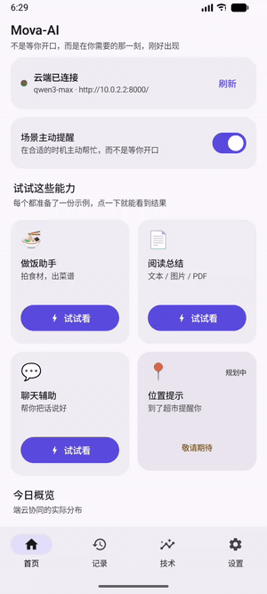

### 界面画廊

| 首启向导 | 首页 | 做饭 · 输入 | 做饭 · 结果 |
|---|---|---|---|
| 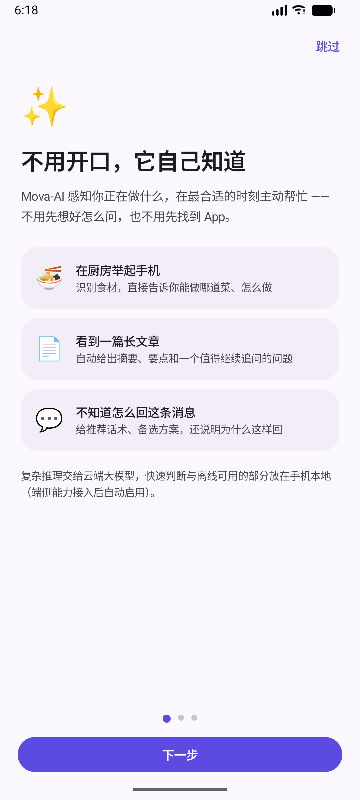 | 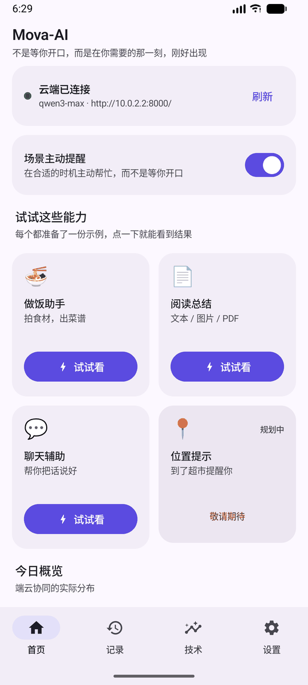 | 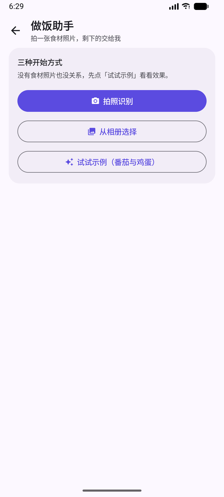 | 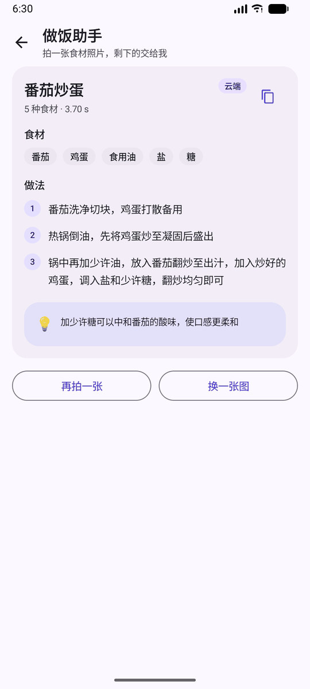 |

| 阅读 · 输入 | 阅读 · 结果 | 聊天 · 输入 | 聊天 · 结果 |
|---|---|---|---|
| 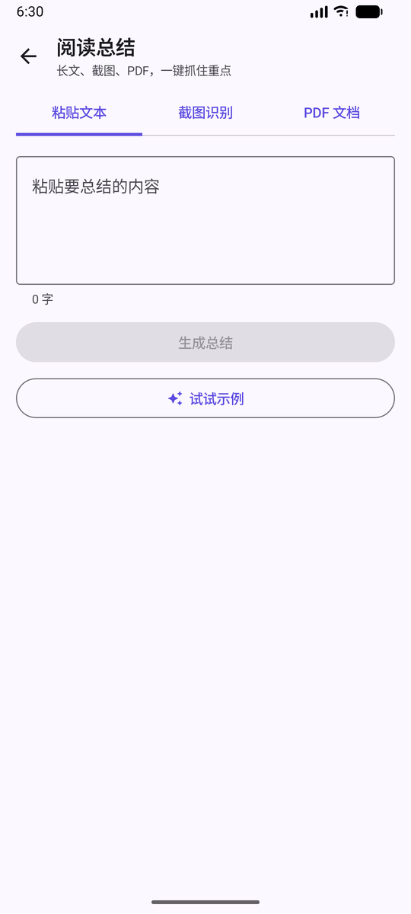 | 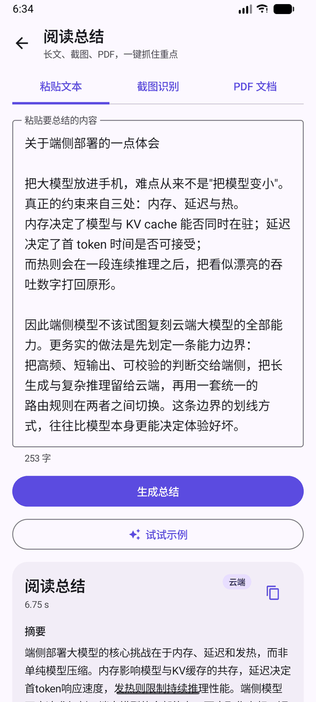 | 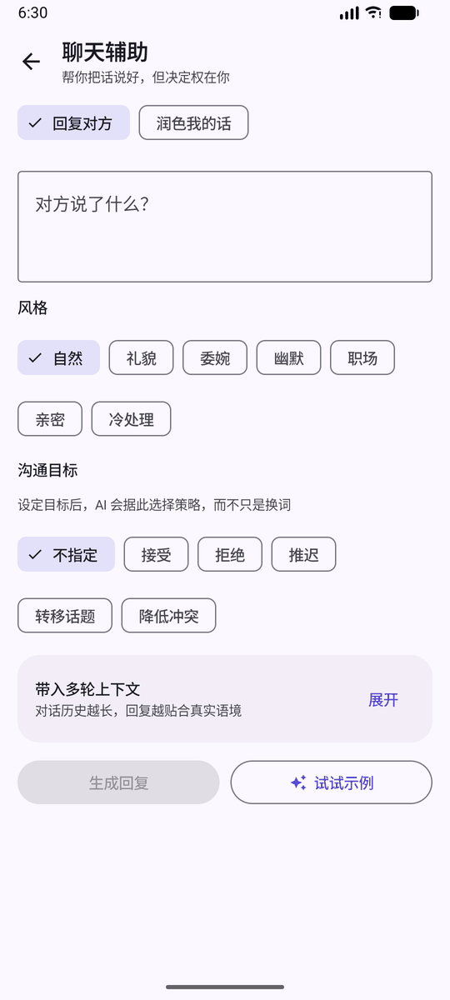 | 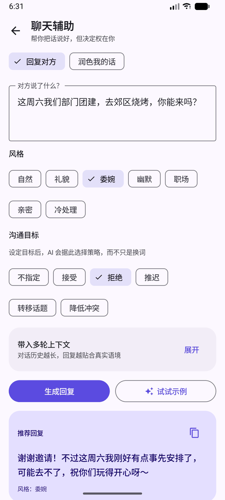 |

| 记录 | 技术面板 | 设置 | 关于 |
|---|---|---|---|
| 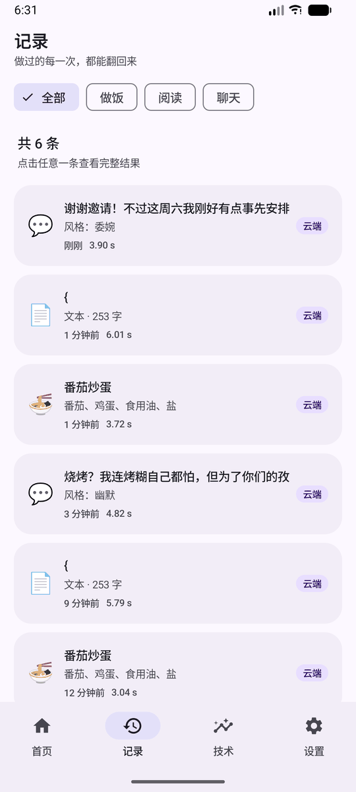 | 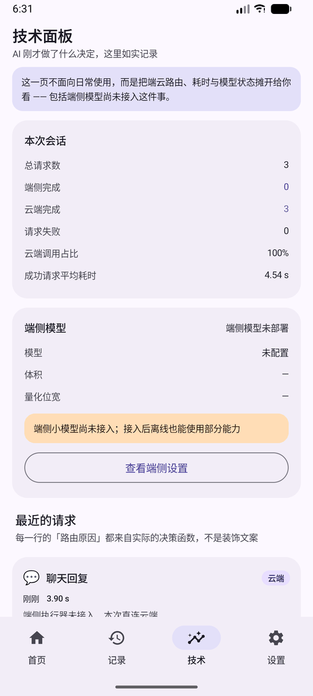 | 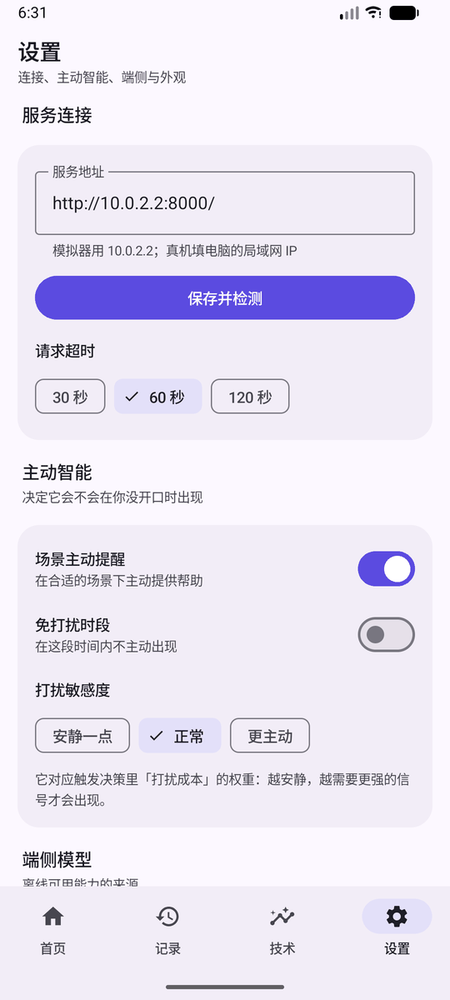 | 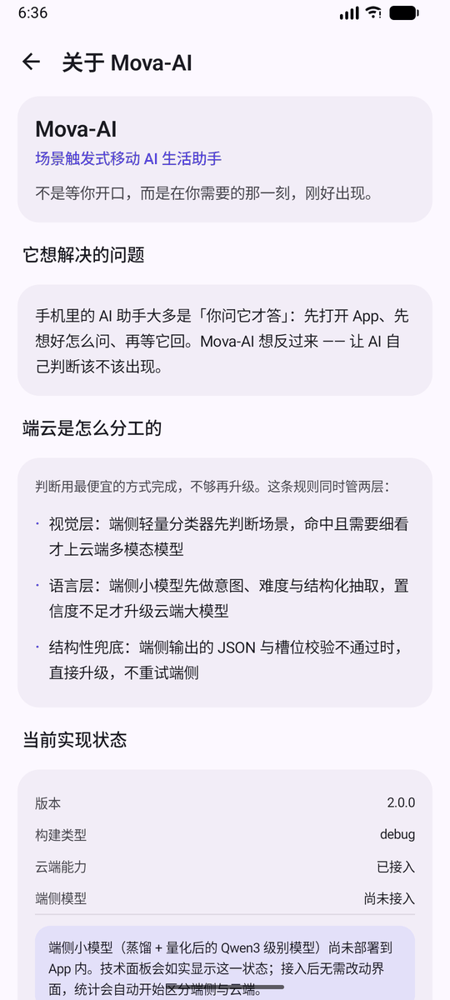 |

> 所有截图与动画均来自模拟器真实运行，非设计稿。几个值得注意的细节：
> - 技术面板的阶段耗时来自服务端 `meta.stages`；动画中的具体数值是录制时的单次运行结果，不是跨设备性能基准
> - **端侧模型状态如实显示「未部署」**，并说明接入后会自动点亮端侧统计
> - 位置提示卡片显示「规划中」，没有假装已实现

### 从微信分享进来（聊天辅助的接入方式）

在微信里长按对方的消息 → 分享 → Mova-AI，内容会自动填入并立刻生成回复建议：

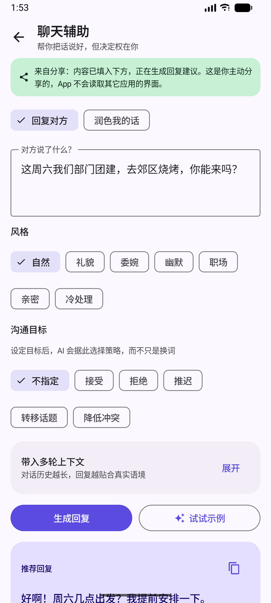

聊天输入采用 Android 系统分享入口：用户在来源应用中主动选择内容，再分享给 Mova-AI。
另一种设计是通过 `AccessibilityService` 读取其它应用界面；它能减少手动操作，但需要更广泛的界面访问权限，也更依赖来源应用的 UI 结构。

| 维度 | 无障碍读屏 | 分享入口（本方案） |
|---|---|---|
| 用户操作 | 可减少手动分享 | 用户显式选择并分享内容 |
| 数据范围 | 可能接触来源应用的更多界面信息 | 仅接收系统分享的内容 |
| 维护成本 | 依赖来源应用 UI 结构 | 使用 Android 标准 Intent |

当前实现优先采用显式分享，以缩小数据范围并降低对第三方界面结构的耦合。界面会提示用户：内容由用户主动分享，App 不读取其它应用界面。

### 页面说明

| 页面 | 说明 |
|---|---|
| 首启向导 | 3 屏，含**连接检测**（失败时给出排查清单）与「演示模式」兜底 |
| 首页 | 连接状态卡 → 主动智能总开关 → 场景能力网格 → 今日端云概览 |
| 做饭助手 | 拍照（**全分辨率**）/ 相册 / 试试示例 → 阶段化加载（识别→生成）→ 菜谱卡 |
| 阅读总结 | 文本 / 截图 / PDF 三 tab，**同一套输出契约**，结果卡只写一份 |
| 聊天辅助 | 风格 chips + 目标 chips + 可展开多轮上下文 + **接收系统分享** |
| 记录 | 按场景筛选，每条带**端侧/云端徽标**，可点进详情 |
| 技术面板 | 会话统计、延迟拆解、端侧模型状态、最近请求与**路由原因**、导出日志 |
| 设置 | 服务连接、主动智能（免打扰/敏感度）、端侧、外观、数据、关于 |

> 技术面板是面向用户的可观测性界面：展示执行端、延迟拆解、端侧模型状态与路由原因。

---

## 四、技术栈

**Android 端（`SceneAi_App/`）**

| 项 | 选型 | 为什么 |
|---|---|---|
| 语言 | **Kotlin 2.1** | 协程 + 密封类，适合表达"加载/成功/失败/降级"状态机 |
| UI | **Jetpack Compose + Material 3** | 多页面 + 动态状态（阶段化加载、降级横幅）代码量远低于 XML |
| 导航 | Navigation Compose | 单 Activity，路由集中声明 |
| 状态 | ViewModel + StateFlow | 单向数据流，UI 只渲染 UiState |
| 网络 | Retrofit + OkHttp + kotlinx.serialization | 与后端契约一一对应，编译期强类型 |
| 本地存储 | DataStore(Preferences) + JSON 文件 | 设置用 DataStore；历史记录量小（≤200 条），用文件省掉 Room 的注解处理器 |
| 依赖注入 | 手写 `AppContainer` | 依赖图只有 4 个对象，比引入 Hilt 更透明、编译更快 |
| 构建 | Gradle 8.13 + AGP 8.13.1 + Version Catalog | 版本集中管理 |

**云侧（`scene_ai_server/`）**

| 项 | 选型 | 为什么 |
|---|---|---|
| 框架 | FastAPI + Pydantic | 契约即代码，自动生成 OpenAPI |
| 模型调用 | **只实现一次 OpenAI 兼容协议** | DashScope 兼容模式 / DeepSeek / 自建 vLLM 都说这套协议，一个类覆盖三家 |
| 容错 | 指数退避重试 + JSON 多层兜底提取 | 小模型不按格式返回是常态，在解析层尽量救回来 |
| 上传校验 | **魔数嗅探**而非信任 Content-Type | 堵住"上传接口无校验"这个经典问题 |
| 可观测 | 每个响应带 `meta`（执行方式/模型/耗时/阶段拆解/路由原因） | App 技术面板的唯一数据源 |

---

## 五、快速开始

### 第 1 步：启动云端服务

```bash
cd scene_ai_server
pip install -r requirements.txt
```

配置 API Key（**源码中不含任何密钥**）。复制模板后填入：

```powershell
Copy-Item .env.example .env      # PowerShell
# cp .env.example .env           # Bash
```

编辑 `.env`，至少填一个 Key：

```ini
MOVA_PROVIDER=dashscope
DASHSCOPE_API_KEY=sk-你的Key
# 也可以切成 DeepSeek：
# MOVA_PROVIDER=deepseek
# DEEPSEEK_API_KEY=sk-你的Key
```

也可以不用 `.env`，直接设置环境变量（`DASHSCOPE_API_KEY` / `DEEPSEEK_API_KEY` / `MOVA_API_KEY`）。

启动（**端口必须是 8000**，与 App 默认地址一致）：

```bash
uvicorn app:app --host 0.0.0.0 --port 8000 --reload
```

- 交互式文档：**http://localhost:8000/docs**
- 健康检查：**http://localhost:8000/health**（首启向导的「检测连接」就是打这个）

### 第 2 步：编译运行 Android 端

1. 用 **Android Studio** 打开 `SceneAi_App/` 目录（**不是仓库根目录**）
2. 确认 **JDK 17+**（JDK 21 已验证）
3. 连接真机或模拟器，点击 Run

命令行构建：

```powershell
cd SceneAi_App
$env:JAVA_HOME = "你的 JDK 路径"
.\gradlew.bat :app:assembleDebug
```

产物：`app/build/outputs/apk/debug/app-debug.apk`

### 第 3 步：配置联调地址

App 内可以随时改：**设置 → 服务连接**，或**首启向导第 3 屏**点「检测连接」。

| 调试方式 | 地址 |
|---|---|
| 模拟器 | `http://10.0.2.2:8000/`（10.0.2.2 是模拟器访问宿主机 localhost 的固定别名） |
| 真机 | `http://电脑的局域网IP:8000/`（`ipconfig` 查询，手机与电脑须同一网段） |

服务以 `--host 0.0.0.0` 启动，真机可直接通过局域网 IP 访问。

### 第 4 步（可选）：跑一遍数据引擎

数据构造不需要 GPU，但需要可访问的教师模型服务和对应 API 配置。下面命令是仓库内的小规模流水线试跑：

```bash
cd scene_ai_server
python smoke_test.py --vision          # 测试当前 Provider 的文本/视觉调用（视觉模型可选）
python pipeline/build_dataset.py --limit 150 --budget 60
python pipeline/evaluate.py --predictor teacher-b
```

这会生成早期 pilot 规模的数据集，不会复现服务器上的 5500/500 正式训练批次。产物落在 `scene_ai_server/data/`；教师调用有缓存，重复运行可复用已缓存的标注。

### 第 5 步：运行 Qwen3-0.6B LoRA SFT

训练需要支持 CUDA 的 PyTorch、Transformers、PEFT，以及本地 Qwen3-0.6B 底座权重。在线服务依赖与训练依赖分列在 `requirements.txt` 和 `requirements-train.txt` 中。正式训练数据保存在训练服务器上，不随 GitHub 仓库发布；`build_sft.py` 会校验正式数据批次的 MD5，仓库内 60 条 pilot 数据不能通过该正式批次校验。

```bash
cd scene_ai_server
pip install -r requirements-train.txt
# 将服务器正式批次放到 data/distill_dataset.jsonl，或通过 --input 指定路径
python build_sft.py --input data/distill_dataset.jsonl --output data/sft_train.jsonl
wc -l data/sft_train.jsonl       # 正式批次应为 5500 条
python train_lora.py \
  --base-model /path/to/Qwen3-0.6B \
  --train-file data/sft_train.jsonl \
  --output-dir data/model_output/qwen3-0.6b-lora
```

训练脚本默认 3 个 epoch、LoRA rank 16、BF16、最大序列长度 2048，并在每个 epoch 保存 adapter。全量模型评估需先用 `predict_lora.py` 生成预测，再通过 `pipeline/evaluate.py --predictor file` 计算指标。具体 CUDA/PyTorch 安装方式取决于训练机驱动与 CUDA 运行时。
不传 `--adapter` 时，`predict_lora.py` 会直接评估未微调底座，供三个 LoRA checkpoint 对照；正式评测请使用服务器上的 500 条 gold。

```bash
python predict_lora.py \
  --base-model /path/to/Qwen3-0.6B \
  --adapter data/model_output/qwen3-0.6b-lora/epoch-1 \
  --gold data/eval_gold.jsonl \
  --output data/model_output/qwen3-0.6b-lora/epoch-1/predictions.jsonl
python pipeline/evaluate.py \
  --gold data/eval_gold.jsonl \
  --predictor file \
  --predictions data/model_output/qwen3-0.6b-lora/epoch-1/predictions.jsonl \
  --out data/model_output/qwen3-0.6b-lora/epoch-1/eval_report.md
```

---

## 六、接口文档

基地址 `http://<host>:8000`。业务分析接口在响应中附带 `meta`，用于记录模型、耗时、执行方式与路由原因；`/health` 和 `/capabilities` 返回服务状态与能力清单，不包含该字段：

```json
{
  "meta": {
    "executor": "cloud",
    "model": "<configured-model>",
    "latency_ms": 1240,
    "route_reason": "端侧执行器未接入，本次直连云端",
    "stages": { "recognize": 420, "generate": 820 },
    "confidence": null
  }
}
```

| 接口 | 入参 | 返回要点 |
|---|---|---|
| `GET /health` | — | `status`、`version`、`provider`、`models`、`edge` |
| `GET /capabilities` | — | 场景清单（驱动客户端首页能力网格） |
| `POST /analyze_image` | multipart `file` | `ingredients` / `dish` / `steps` / `tips` + `meta.stages` 两段耗时 |
| `POST /reading/text` | JSON `{content}` | `summary` / `key_points` / `difficulty` / `qa_suggestion` |
| `POST /reading/image` | multipart `file` | 同上 |
| `POST /reading/pdf` | multipart `file` | 同上 + `page_count` |
| `POST /chat/reply` | JSON `{context, style}` | `reply` / `alternatives[]` / `explain` |
| `POST /chat/rewrite` | JSON `{text, style}` | 同上 |
| `POST /chat/context` | JSON `{messages[], goal, style}` | 同上 |

**返回示例**（`/chat/reply`）：

```json
{
  "scene": "chat",
  "reply": "这周实在排不开，下周我来定时间可以吗？",
  "style": "委婉",
  "alternatives": ["最近手上事有点多，我们约下周？", "这次先不参加了，下次一定到"],
  "explain": "先给出客观原因再提供替代方案，既明确拒绝又保留关系",
  "meta": { "executor": "cloud", "model": "qwen3-max", "latency_ms": 980, "route_reason": "端侧执行器未接入，本次直连云端", "stages": {} }
}
```

---

## 七、数据构造与训练数据

数据链路分为两种规模：仓库提交的是用于验证数据引擎的 pilot 样本；当前正式 LoRA 训练批次在服务器侧生成和校验，避免把完整训练数据直接提交到公开仓库。

### 正式训练批次（服务器侧）

| 数据 | 数量 | 用途 |
|---|---:|---|
| `data/distill_dataset.jsonl` | 5500 | 教师标注的结构化场景理解 SFT 样本 |
| `data/eval_gold.jsonl` | 500 | 分层评测；以教师标签为主，并对个别样本做人工修正 |
| `data/sft_train_*.jsonl` | 5500 | `build_sft.py` 从正式数据转换得到的 user/assistant 对话 |

正式训练集 MD5 为 `d32b73adbc456212f42eaae2099d93ee`，由 `build_sft.py` 默认校验。SFT 监督只作用于 assistant 侧的结构化 target；当前这轮是 **Qwen3-0.6B 的 LoRA SFT**，不是 Logit 或 Feature 蒸馏。评测集标签仍以教师标注为主，因此学生在该集合上的分数不能等同于人工标注基准上的绝对准确率。

正式训练批次的场景构成：

| 教师标签场景 | 样本数 | 占比 |
|---|---:|---:|
| food | 2148 | 39.1% |
| reading | 1566 | 28.5% |
| none | 646 | 11.7% |
| location | 597 | 10.9% |
| chat | 543 | 9.9% |

### LoRA 训练实测

| 指标 | 结果 |
|---|---:|
| 50 条冒烟测试 | 1 epoch 完成；平均 loss 1.2224；PyTorch 峰值已分配显存 17.85 GiB |
| 可训练参数 | 10,092,544 / 606,142,464（1.6650%） |
| 正式训练 | 5500 条、3 epoch、516 个优化 step；`python exit=0` |
| 第 3 轮平均训练 loss | 0.0529 |
| 正式训练 PyTorch 峰值已分配显存 | 18.15 GiB |

这些是训练日志中的数据，显存列为 PyTorch 统计值，并非整卡占用。500 条 gold 的底座与三个 epoch 预测尚未运行，因此目前没有学生模型的泛化指标，也尚未选定最佳 checkpoint。完整故障与修复记录见[阶段二训练记录](docs/06-阶段二训练记录.md)。

### 数据引擎 pilot（仓库内报告）

仓库内 `dataset_report.md` 和 `eval_report.md` 记录的是早期试跑：150 条种子候选，经筛选得到 60 条训练样本和 40 条评测样本。下面的覆盖率与教师一致率指标只描述这轮 pilot，不代表服务器上的 5500/500 正式批次。

```bash
cd scene_ai_server
python pipeline/build_dataset.py --limit 150 --budget 60
```

```
① 种子展开 (150)  →  ② 双教师标注  →  ③ 契约校验  →  ④ 三信号难度
                                    →  ⑤ MinHash 去重  →  ⑥ 子模覆盖  →  ⑦ 配额配比
```

### 实测结果（全部来自真实运行，未手工填写）

| 阶段 | 指标 | 结果 |
|---|---|---|
| ③ 契约校验 | **契约合法率** | **100%**（150/150） |
| ④ 难度评估 | 平均难度 / 三信号可用数 | 0.312 / 150·150·143（教师置信度暂代学生探针损失） |
| ⑤ 去重 | LSH 候选对 → 精确复核删除 | 274 → **22 条（14.7%）** |
| ⑥ 覆盖优化 | 网格覆盖 | **37/37 格** |
| ⑥ 覆盖优化 | 子模目标 F vs 随机基线 | 47.01 vs 39.71 → **提升 18.4%** |
| ⑦ 配额配比 | 难度分布 vs 目标 (30/50/20) | **36.7% / 50.0% / 13.3%** |
| 40 条 pilot 评测 | 教师 B 对教师 A 标签的一致率 | scene 87.2% / intent 82.0% / 槽位 F1 0.838 |

### Pilot 阶段的三个问题与修正

1. **契约枚举用了英文、prompt 又没列取值 → 合法率 0%。** 教师只能猜，输出「晚饭」而不是 `dinner`。修正后 100%。教训：*契约必须显式到模型能照抄的程度。*
2. **`temperature=0` 会摧毁 logprobs。** 极低温度把分布压成 one-hot，接口返回的 `logprob` 恒为 0、候选恒为 -9999。因此标签（T=0，保证可复现）与软标签（T=1，保证分布有意义）**必须分成两次调用**。
3. **难度分布稀疏是语料问题，不是度量问题。** 第一轮 120 条全落进 easy 档；排查后发现种子都是"换个食材名"式的表面变化，任务本身毫无歧义。补上真正的困难样本、并把采样从「全局随机截断」改成「按组轮转」后，hard 档才被填满。

> 第 3 条对任何数据流水线都成立：**稀有类别必须显式保底，不能指望随机采样照顾它。**

### Pilot 产物（随仓库提交）

| 文件 | 内容 |
|---|---|
| `data/distill_dataset.jsonl` | 蒸馏数据集：硬标签 + **软标签（教师 top-K 分布）** + 难度 + 质量分 |
| `data/eval_gold.jsonl` | 评测集 v1（与训练集按 id 严格互斥） |
| `data/edge_contract.schema.json` | 端侧语法约束解码用的 JSON Schema |
| `data/dataset_report.md` | 自动生成的统计报告 |
| `data/eval_report.md` | 评测报告（标签噪声下限） |

在这 40 条 pilot 评测中，`none`（无场景/歧义输入）的教师间一致率较低（42.9%）。这是标注分歧的观察结果，不是对“难度信号有效性”的因果证明；后续需在正式评测集上重新验证。

---

## 八、端侧模型路线图

详细方案见 [`docs/02-端侧模型方案.md`](docs/02-端侧模型方案.md)，这里只给结论：

| 环节 | 方案要点 |
|---|---|
| **能力契约** | 端侧候选任务为场景/意图识别、复杂度估计、路由建议与槽位抽取；长生成和复杂任务保留云端路径 |
| **当前训练** | Qwen3-0.6B + LoRA，基于教师生成的结构化标签做 response-level SFT；三轮训练完成，评测待运行 |
| **下一步评估** | 在 500 条分层评测集上计算契约合法率、scene/intent、need_cloud、complexity MAE、槽位 P/R/F1，并分析分场景错误 |
| **蒸馏扩展** | 当前未实现 Logit/Feature 蒸馏；后续可评估 top-K logits 缓存和中间层表征蒸馏的收益与成本 |
| **量化与运行时** | 端侧接入前再比较 GGUF/llama.cpp、LiteRT-LM 等方案，并按目标手机实测延迟、峰值内存和功耗 |
| **路由校准** | 对模型置信度做校准，并用端侧/云端实测质量与延迟确定升级阈值；当前 Kotlin 决策逻辑尚未由端侧模型驱动 |

> **当前边界**：端侧 adapter 尚未集成进 App，端侧推理、置信度校准、量化与真实端云级联效果尚无实测结果。

---

## 九、目录结构

```
Mova-AI/
├── docs/                                   # 📘 设计文档
│   ├── 01-总体设计.md                       #    问题定义、级联路由框架、创新点、实验设计、路线图
│   ├── 02-端侧模型方案.md                    #    能力契约、数据引擎、三层蒸馏、量化、运行时、路由
│   └── 03-UI-UX设计规范.md                   #    信息架构、页面规格、设计 token、文案规范
│
├── scene_ai_server/                        # 🐍 云侧服务 + 离线流水线
│   ├── app.py                              #    路由层（唯一处理 HTTP 的地方）
│   ├── jsonx.py                            #    零依赖 JSON 兜底提取（在线与离线共用）
│   ├── mova/
│   │   ├── config.py                       #    配置（唯一读环境变量的地方）
│   │   ├── providers.py                    #    厂商适配（唯一发请求的地方）
│   │   └── prompts.py                      #    提示词（唯一写 prompt 的地方）
│   ├── pipeline/                           #    🔬 教师调用、数据筛选、契约校验与评测
│   │   ├── contract.py                     #      S1 能力契约 + JSON Schema + 校验器
│   │   ├── seeds.py                        #      场景种子库（按组轮转采样）
│   │   ├── teacher.py                      #      双教师客户端（含 logprobs 捕获）
│   │   ├── difficulty.py                   #      三信号难度
│   │   ├── dedup.py                        #      MinHash + LSH
│   │   ├── coverage.py                     #      子模最大化覆盖
│   │   ├── allocate.py                     #      配额配比（最大余数法）
│   │   ├── build_dataset.py                #      主流程 + 报告生成
│   │   └── evaluate.py                     #      评测（含标签噪声下限）
│   ├── data/                               #    产物：数据集 / 评测集 / 报告（cache 已忽略）
│   ├── build_sft.py                         #    将教师标注转换为 chat-format SFT JSONL
│   ├── train_lora.py                        #    Qwen3-0.6B LoRA SFT 训练
│   ├── predict_lora.py                      #    加载底座与 adapter 生成评测预测
│   ├── requirements.txt · requirements-train.txt
│   └── .env.example
│
├── SceneAi_App/                            # 📱 Android 端（Kotlin + Compose，单 Activity）
│   ├── app/src/main/java/com/mova/sceneai/
│   │   ├── MainActivity.kt · MovaApp.kt
│   │   ├── core/                           #    容器 / 设置 / 错误 / 媒体 / 格式化
│   │   ├── data/                           #    model / remote / local / repo（含 Router）
│   │   └── ui/                             #    theme / nav / components / 各页面
│   ├── keystore/debug.keystore             #    一次性调试密钥（口令为约定的 android）
│   └── gradle/libs.versions.toml
│
└── README.md
```

---

## 十、实现进度

图例：✅ 已验证　🟡 进行中　⬜ 未开始或仅有设计

| 层 | 模块 | 状态 |
|---|---|---|
| 端·交互 | Compose 多页面应用 | ✅ **编译通过，产出 APK** |
| 端·交互 | 首启向导（价值 → 权限 → 连接检测） | ✅ |
| 端·交互 | 结构化结果渲染（全面取代 Toast） | ✅ |
| 端·交互 | 一键示例（三个场景各一份，冷启动友好） | ✅ |
| 端·交互 | 聊天辅助接收系统分享（`ACTION_SEND`，微信长按消息即可） | ✅ **已在模拟器验证** |
| 端·交互 | 「为什么现在完成」技术面板 + 端云徽标 | ✅ |
| 端·网络 | Retrofit + 统一错误翻译（三件套文案） | ✅ |
| 端·路由 | `Router` 代价敏感决策函数（端侧未就绪时恒走云端） | ✅ 代码就绪 |
| 端·推理 | 端侧 SLM 执行器（llama.cpp JNI） | ⬜ |
| 端·推理 | 视觉轻量分类器 | ⬜ |
| 端·路由 | 置信度校准 + 语法约束解码 + 槽位校验 | ⬜ |
| 端·感知 | 触发决策（老虎机 + 退避）、悬浮窗、位置感知 | ⬜ |
| 端·感知 | ~~无障碍读屏~~ → **主动放弃**，改用系统分享入口（合规性见上文） | 🚫 不采用 |
| 云·在线 | 7 个能力接口 + `/health` + `/capabilities` + `meta` | ✅ |
| 云·在线 | Provider 抽象（DashScope ⇄ DeepSeek ⇄ 自建） | ✅ |
| 云·在线 | 魔数校验、体积上限、重试退避、结构化日志、CORS | ✅ |
| 云·离线 | **S1 能力契约**（可执行契约 + JSON Schema + 校验器） | ✅ |
| 云·离线 | **数据引擎 pilot**（教师标注 → 难度/质量信号 → MinHash 去重 → 覆盖选择 → 配额补齐） | ✅ 150 条种子试跑 |
| 云·离线 | 正式 SFT 数据准备（5500 train / 500 eval） | ✅ 服务器侧校验完成 |
| 云·离线 | Qwen3-0.6B LoRA response-level SFT | ✅ 50 条 smoke 与 5500 条正式训练完成；3 个 epoch adapter 已保存 |
| 云·离线 | 预测生成与契约评测脚本 | 🟡 代码已准备；500 条 gold 的底座及 3 个 adapter 对照尚未运行 |
| 云·离线 | Logit / Feature 蒸馏 | ⬜ 当前训练未使用软标签或中间层特征 |
| 云·离线 | 量化（分层敏感性 + 背包比特分配） | ⬜ |
| 工程 | 单元测试与仪器测试 | ⬜ |

---

## 十一、已知限制

- **端侧模型未接入**：当前所有推理都在云端完成；`Router` 已实现完整规则，端侧就绪后自动生效
- **仓库 pilot 与正式训练数据不同**：仓库跟踪 60 条训练样本和 40 条评测样本；服务器正式批次为 5500/500，正式数据未提交到 GitHub。公开报告中的 pilot 指标不能替代正式批次评估
- **评测标签仍不等于人工基准**：500 条正式评测样本以教师标注为主，仅个别样本人工修正；需要增加独立人工复核后，才能报告更强的绝对准确率结论
- **当前只做 response-level SFT**：训练脚本仅对 assistant target 计算交叉熵；没有进行 Logit/Feature 蒸馏，也未量化
- **端侧模型尚未接入**：当前 Android 请求仍走 FastAPI 云端服务。`Router` 决策代码已存在，但端侧执行器、模型置信度校准和实测路由阈值尚未完成
- **聊天辅助通过系统分享接入**：不实现后台读取其它应用界面；这是出于数据范围和 UI 耦合考虑所作的产品选择
- **场景自动触发未实现**：位置感知、悬浮窗、上下文老虎机触发决策仍是设计稿
  （`Router.kt` 里的代价敏感决策规则已实现，只是端侧执行器尚未接入）
- **服务端无鉴权**：任何能访问到端口的人都能消耗你的模型额度，**切勿直接暴露到公网**
- **明文 HTTP**：`network_security_config.xml` 为本地联调放开了明文流量，上线前需收紧
- **自动化测试覆盖不足**：当前仓库尚未提供可覆盖核心业务链路的单元测试与仪器测试
- **release 未开混淆**：开启前需为 kotlinx.serialization / Retrofit 补 keep 规则

---

## 十二、开发环境注意事项

| 事项 | 说明 |
|---|---|
| **仓库路径** | 仓库目录名为 `Mova-AI`。Gradle 配置保留了 `android.overridePathCheck=true`，用于兼容含非 ASCII 字符的上级目录；建议仍优先使用英文路径 |
| **调试密钥** | AGP 默认在 `~/.android/` 自动生成调试密钥，在受限环境（沙箱 / 无家目录写权限的 CI）会失败。这里改为使用仓库内置的 `SceneAi_App/keystore/debug.keystore`，其口令就是 Android 约定的 `android`，**不具备任何保密性**，仅供本地安装调试；release 请另行配置签名 |
| **Gradle 发行版** | `gradle-wrapper.properties` 默认使用阿里云镜像（文件里注释了官方地址与腾讯镜像）。之所以默认镜像：在部分网络环境下 JVM 直连 `services.gradle.org` 会在 TLS 握手阶段收到 Connection reset，而镜像站稳定可用 |
| **模型密钥** | 只放在服务端 `.env` 或环境变量里，**App 端永远不内置任何 Key** |
| **PDF 解析** | 默认只解析前 3 页（`MOVA_MAX_PDF_PAGES`），扫描件因无可提取文字会返回 422 并提示改用截图识别 |
| **数据与训练依赖** | 教师调用需要服务端 Provider 依赖和 API 配置；训练额外需要与机器 CUDA 环境匹配的 PyTorch、Transformers、PEFT 等，见 `requirements-train.txt` |

---

## 十三、文档索引

| 文档 | 内容 |
|---|---|
| [`docs/01-总体设计.md`](docs/01-总体设计.md) | 问题定义、代价敏感级联路由框架、系统架构、技术选型、5 个创新点、**消融实验设计**、9 阶段路线图、风险预案 |
| [`docs/02-端侧模型方案.md`](docs/02-端侧模型方案.md) | 能力契约、数据引擎（三信号难度 / 子模覆盖 / LP 配比）、三层蒸馏、量化（分层敏感性 + 背包比特分配）、端侧运行时、端云路由、测量协议 |
| [`docs/03-UI-UX设计规范.md`](docs/03-UI-UX设计规范.md) | 新用户友好 8 条验收标准、信息架构、页面规格、设计 token、文案规范 |
| [`docs/04-能力契约.md`](docs/04-能力契约.md) | **S1**：端侧要学什么、为什么让模型自己输出 `need_cloud`、契约为什么必须可执行、两个实测缺陷的记录 |
| [`docs/05-数据引擎.md`](docs/05-数据引擎.md) | **S2**：三信号难度、MinHash+LSH、子模覆盖的数学依据、配额最优性说明、**三个实测发现** |
| [`docs/06-阶段二训练记录.md`](docs/06-阶段二训练记录.md) | **阶段二实战**：共享 GPU 配置、模型上传/环境/tokenizer 故障、修复步骤、训练实测指标与待完成评测 |
| [`docs/archive/`](docs/archive) | 早期方案存档（已被上面几份取代，保留以记录设计演进） |

---

<p align="center">
  <b>不是等你开口，而是在你需要的那一刻，刚好出现。</b><br/>
  <sub>Mova-AI · 场景触发式移动 AI 生活助手</sub>
</p>
